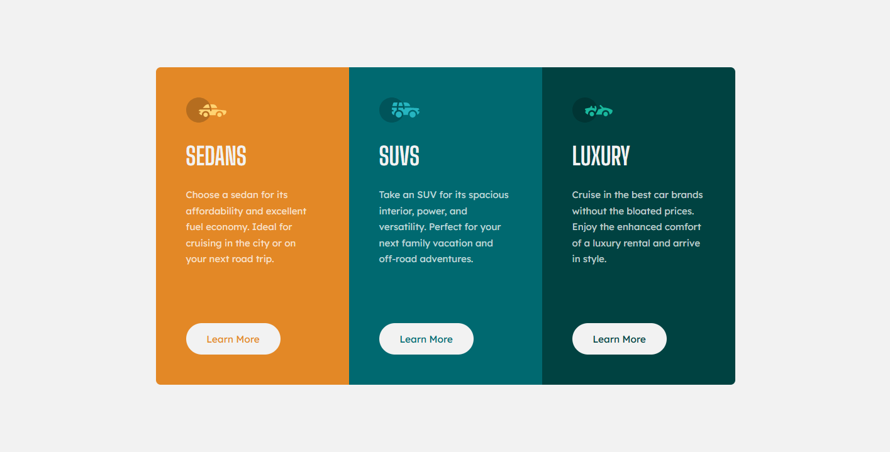

# My fourth project and solution to the 3-column preview card component challenge over at [Frontend Mentor](https://www.frontendmentor.io/challenges) using nth child pseudo-selectors and CSS variables

## This was the assignment

## This is my solution

[Click here to see the live page](https://arthurpog.github.io/3-column-preview-card-component/)

I had 2 goals during this project.

1. Get acquainted with CSS variables
2. Only use nth-child pseudo-selectors instead of classes

Both goals were accomplished.

Just keep in mind that I was not concerned whether it is good practice or not to use this approach in this project. I just needed to apply my theoretical knowledge somewhere.
